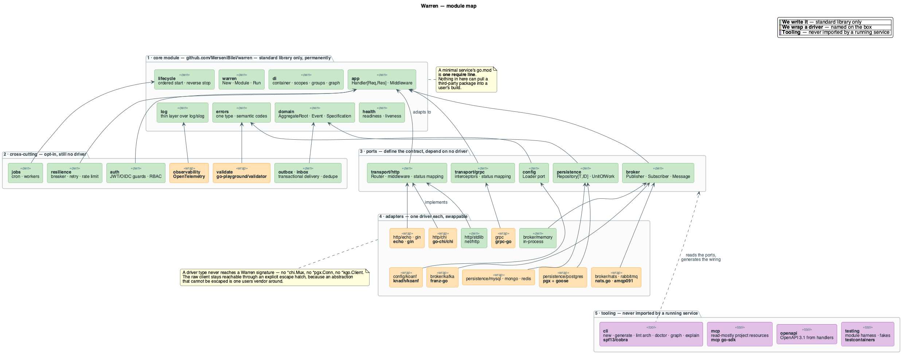
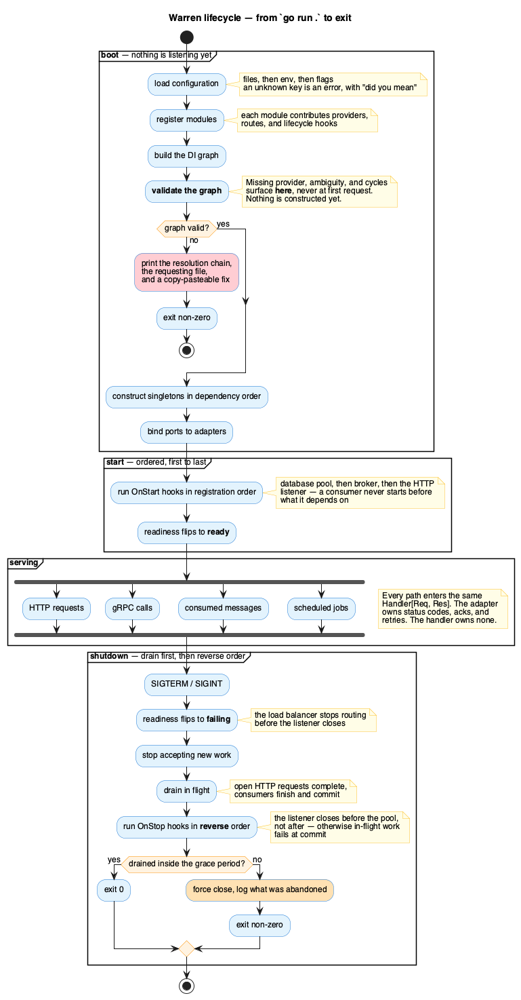

# Warren Architecture

How Warren itself is built: what we write, what we wrap, and what happens
between `go run .` and process exit.

Diagrams are generated from [`assets/architecture.puml`](assets/architecture.puml).
From the repository root:

```bash
java -jar ~/.local/bin/plantuml.jar -tpng -o . docs/assets/architecture.puml
```

---

## 1. The one idea

Everything below follows from one commitment:

> **A use case is written once and knows nothing about how it is invoked.**

```go
type Handler[Req any, Res any] interface {
    Handle(ctx context.Context, req Req) (Res, error)
}
```

HTTP, gRPC, CLI, and message consumers are adapters over this type. The adapter
owns its concerns entirely — HTTP owns status codes and content negotiation,
gRPC owns proto marshalling, the consumer owns acks, retries, and DLQ routing.
The handler owns none of them, and imports none of them.

If a change makes a handler import a transport package, the change is wrong.
This is the invariant the rest of the architecture exists to protect.

---

## 2. Module map



Five bands, and dependencies only ever point **inward**:

| Band | What it is | Rule |
|---|---|---|
| **1 · core** | `warren` + `di` `lifecycle` `app` `domain` `errors` `log` `health` | Standard library only, permanently |
| **2 · cross-cutting** | `outbox` `inbox` `resilience` `jobs` `auth` `validate` `observability` | Opt-in; a service that does not import one does not pay for it |
| **3 · ports** | `transport/http` `transport/grpc` `broker` `persistence` `config` | Define the contract; depend on no driver |
| **4 · adapters** | chi, stdlib, echo, gin, grpc-go, franz-go, pgx, koanf, … | One driver each; interchangeable behind a port |
| **5 · tooling** | `cli` `mcp` `openapi` `testing` | Never imported by a running service |

**Ports live one level above drivers.** `warren/broker` defines `Publisher` and
`Subscriber` and depends on nothing. `warren/broker/kafka` implements them. You
can write and test against the port without pulling a driver — which is also why
the in-memory broker is the default in tests.

**The core's rule.** The core module imports nothing outside the standard
library. Permanently — not "for now", not "except this one". When a core feature
appears to need a library, the feature is split: **the port goes in core, the
implementation goes in a submodule.** That is what makes "a minimal Warren
service pulls almost nothing" demonstrable rather than aspirational.

---

## 3. What we write, and what we wrap

The green boxes are ours. This section says why, because "we wrote it ourselves"
is a cost that has to be justified every time.

### Written by us — standard library only

| Package | Why not a library |
|---|---|
| **`di`** | **Decided 2026-07-28, reversing an earlier decision to wrap `go.uber.org/dig`.** The core module takes no third-party dependency, and `warren.New` needs the container — so wrapping `dig` forced either `New` out of the root import path or a `Container` interface every real service bypasses. Writing it keeps `warren.New` at `github.com/MerseniBilel/warren` and keeps a service's `go.mod` at one require line. It also removes work we were doing anyway: `dig` exposes no graph as data, so `warren graph di` and the boot error messages needed our own provider registry regardless. Cost: roughly 800 lines we own, of which value groups and decoration are the hard part. |
| **`lifecycle`** | Ordered start, reverse stop, drain-before-close and readiness gating are product features, not plumbing. This is why `uber-go/fx` is not used: it owns the lifecycle we need to own. |
| **`errors`** | One type with a semantic code (§6). A library would either impose sentinel errors or a stack-trace model; neither is the shape every transport has to map. |
| **`log`** | `log/slog` is the standard. Our layer is context plumbing and nothing else — no logging framework, ever. |
| **`app`** | `Handler[Req, Res]` and `Middleware` are the one idea. Nothing to wrap. |
| **`domain`** | `AggregateRoot`, `Event`, `Specification[T]` are the product. |
| **`health`** | Two endpoints and a state machine. |
| **ports** (`transport/*`, `broker`, `persistence`, `config`) | A port that wraps a library is not a port. |
| **`broker/memory`, `http/stdlib`** | Reference adapters that must have zero dependencies, so the contract suite can run with no Docker and no network. |
| **`outbox` · `inbox` · `resilience` · `jobs` · `auth`** | Patterns, not integrations. Each is a few hundred lines and each has to compose with our lifecycle and our middleware chain. |

### Wrapped, never exposed

| Package | Driver | Why this one |
|---|---|---|
| `transport/http/chi` | `go-chi/chi` | 100% `net/http`, zero dependencies of its own — the default |
| `transport/http/{echo,gin}` | `echo`, `gin` | Supported because teams already run them |
| `transport/grpc` | `grpc-go` | The only real option |
| `broker/kafka` | `twmb/franz-go` | Transactions and exactly-once, which the outbox needs; `segmentio/kafka-go` has neither and a far larger open-issue count |
| `broker/{nats,rabbitmq}` | `nats.go`, `amqp091-go` | Official clients |
| `persistence/postgres` | `pgx` + `pressly/goose` | `goose` is usable as a library, so migrations run in-process |
| `config` | `knadh/koanf` | Lighter than viper, no global state |
| `validate` | `go-playground/validator` | Struct-tag validation is a solved problem |
| `observability` | OpenTelemetry | A standard, not a library choice |
| `cli` | `spf13/cobra` | Command tree, completions, help |
| `mcp` | `modelcontextprotocol/go-sdk` | Protocol implementation |
| `testing` | `testcontainers-go` | Wrapped because it is still v0 |

**No driver type may appear in a Warren public signature** — not `*chi.Mux`, not
`*pgx.Conn`, not `*kgo.Client`. That is what makes drivers swappable. The
inverse rule matters as much: **the raw client stays reachable** through an
explicit escape hatch, because an abstraction that cannot be escaped is one
users vendor around.

**No dependency is adopted without an audit.** Read the repository and the
documentation — is it archived, when did it last ship, what does it pull in,
what licence — and record what you found before it enters a `go.mod`. That
process found two widely-recommended packages archived: `google/wire` and
`git-chglog`. Neither README said so.

---

## 4. The dependency rule

Inside a service's bounded context, four layers, and dependencies point one way:

```
   interfaces ─────▶ application ─────▶ domain
        │                  │               ▲
        └──────────────────┴───────────────┘
   infrastructure ─────────────────────────┘   (implements domain ports)

   domain imports NOTHING from the other three.
```

| Layer | Holds | May import |
|---|---|---|
| `domain` | Entities, value objects, domain events, repository **interfaces**, domain services | Nothing outside itself |
| `application` | Commands, queries, handlers, DTOs, ports | `domain` |
| `infrastructure` | Repository implementations, publishers, external clients | `domain`, `application` |
| `interfaces` | HTTP controllers, gRPC services, consumers | `domain`, `application` |
| `module.go` | Wiring | All four — the only file that may |

`warren lint arch` enforces this and exits non-zero on violation. Rules are
configurable, so a team wanting a looser layout writes an explicit override that
shows up in review — rather than the rule quietly not existing.

**Warren dogfoods this.** If Warren's own CI cannot run `warren lint arch`
against Warren, the feature is not finished.

---

## 5. Lifecycle



Warren owns application lifecycle rather than delegating it.

**Boot, in order.** Configuration loads first (files, then environment, then
flags; an unknown key is an error, with a "did you mean"). Modules register
their providers, routes, and hooks. The DI graph is built and then **validated
without constructing anything** — a missing provider, an ambiguity, or a cycle
fails the process here, printing the resolution chain, the file that requested
it, and a copy-pasteable fix. Only then are singletons constructed, in
dependency order, and ports bound to adapters.

**Nothing is listening until every one of those steps has succeeded.** A wiring
error is a startup crash, never a 500 on the first request.

**Start is ordered; stop is the reverse.** The database pool starts before the
broker, which starts before the HTTP listener. On shutdown, readiness flips to
failing first — so a load balancer stops routing before the listener closes —
then new work is refused, in-flight work drains, and `OnStop` hooks run in
reverse order. Get that order wrong and consumers fail at commit because the
pool closed underneath them.

**Serving is four doors into the same room.** HTTP requests, gRPC calls,
consumed messages, and scheduled jobs all arrive at the same
`Handler[Req, Res]`.

---

## 6. Errors

One error type with a semantic code. Each transport maps it into its own
vocabulary:

| Semantic code | HTTP | gRPC | Consumer |
|---|---|---|---|
| `NotFound` | 404 | `NOT_FOUND` | ack, log |
| `Conflict` | 409 | `ALREADY_EXISTS` | ack, log |
| `Invalid` | 400 | `INVALID_ARGUMENT` | DLQ |
| `PermissionDenied` | 403 | `PERMISSION_DENIED` | DLQ |
| `Internal` | 500 | `INTERNAL` | nack, retry |

Domain code returns semantic errors and knows nothing about 404. The
`exhaustive` linter runs on these switches, so a new code an adapter forgets to
map fails the build rather than falling through to a 500.

**Error message quality is a feature, not polish.** A message names what failed,
who asked for it, and the fix — because bad DI errors are the single most common
reason people abandon a framework.

---

## 7. What this architecture forbids

The useful part of a design is what it rules out:

- A handler that imports `net/http`, `grpc`, or a broker client.
- A domain package that imports a driver, an ORM, or a transport.
- A driver type in a Warren public signature.
- A third-party import in the core module.
- Cross-module reach into another module's internals — modules communicate by
  published events and generated clients only. This is what makes
  `warren extract module` possible at all.
- A committed `replace` directive.
- Reflection in the request path. Reflection belongs to container construction
  at boot; the hot path is explicit or generated.

---

## 8. Enforced in CI

Not conventions — build failures:

| Rule | Checked by |
|---|---|
| Core module has zero third-party dependencies | `make lint-modules` |
| No third-party DI container imported anywhere | `make lint-modules`, `depguard` |
| No committed `replace`, no `toolchain`, one Go version | `make lint-modules` |
| No driver type in a public signature | `depguard`, review, later `warren lint arch` |
| Layer violations | `warren lint arch` (ships v0.4) |
| Every semantic error code mapped by every transport | `exhaustive` |
